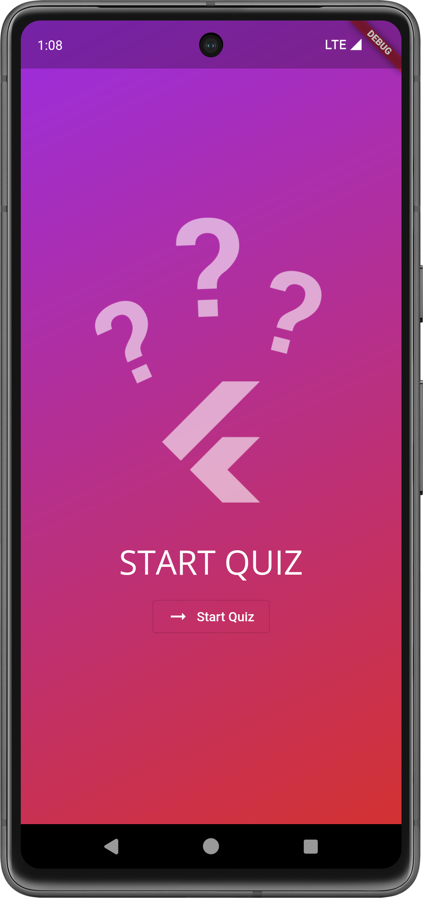
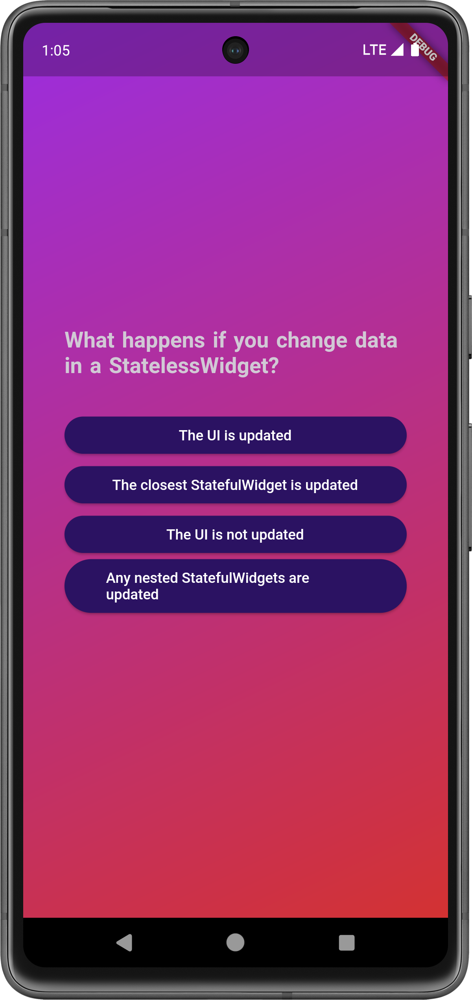
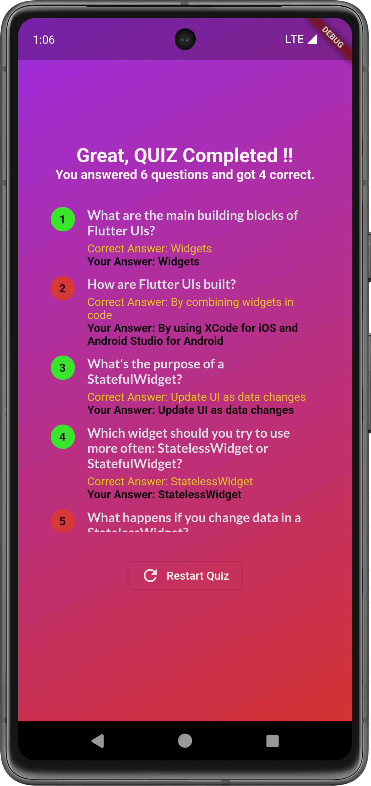

# QuizApp
First flutter app, which is basically an flutter application with multiple stateless widget to show the questions and in the end the app shows the result which the option user selected against and the correct option for each question in a scrollable widget.

# Screenshots
&nbsp; &nbsp; &nbsp; &nbsp; &nbsp; &nbsp; 

#Demo
 

---
